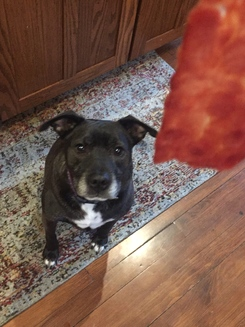
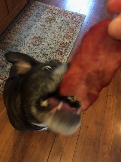

# Tiffany's Portfolio

This is a simple single-page web site aimed at highlighting some of my work and giving onlookers a sneak peak into who I am and what makes me tick.

If you would rather read plain text than a prettily colored and elegantly styled website, here's the gist...

## Who am I?
Hi, my name is Tiffany Boorsma. I'm a Michigan native who has been lucky enough to enjoy some time on both coasts as well as a bit of mountain life in between. While I currently reside back in my hometown of Grand Rapids, I am fond of travel and would be open to relocating for future opportunities.

## What do I do?
I am a full stack software engineer with a strong desire to provide a first class user experience to the end consumer. I am proficient in back end development and design, although my enterprise level experience lies predominantly in front end engineering. Excited by the ever evolving technologies and frameworks emerging, I am keen to learn and build with new frameworks, languages and libraries. Most recently, I have worked on production level software with React, Redux, Angular, Node and vanilla JavaScript 

## Why do I do it?
Someone has to bring home the bacon for this cutie...

and I also, truly enjoy solving problems. There are few more satisfying experiences than achieving the transition from "I don't know" to "Let me show you how," and working in this field
gives me the opportunity to revel in these exciting conversions on a regular basis. 

## Who are YOU?
Now that you know me, I would love the chance to get to know you!
Whether you're looking for an engineer or you're just here for the cute dog, feel free to reach out. 

tiffanyboorsma@gmail.com